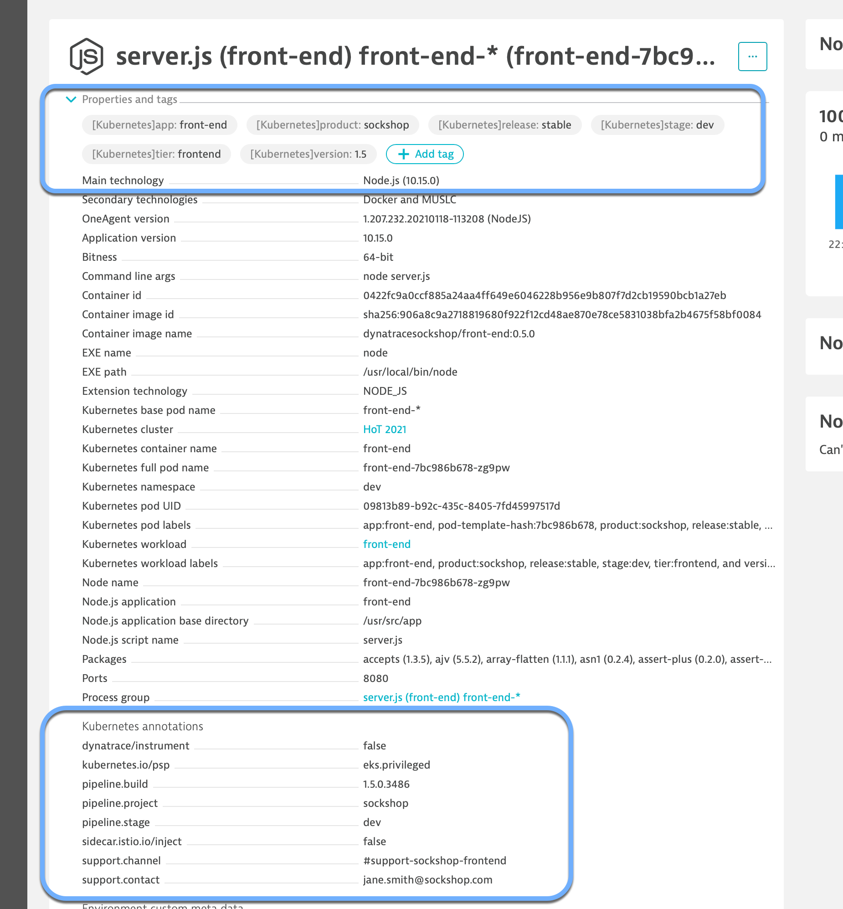

## Deploy Sock Shop Sample Application

This lab will require accessing the EKS Bastion Host you were assigned for this session.

### Deploy SockShop
1.  Clone the application deployment files from the 20201 HoT Github repo
  ```
  git clone https://github.com/Dynatrace/perform-2021-hotday.git
  ```
 /assets/images/lab4-downloadsockshop.png)
 
2.  On the EKS Bastion Host navigate to the "/Dynatrace for Cloud Operators (K8s)/k8s-apps" directory and make the deployment script executable
 ```
  chmod +x deploy-sockshop.sh
  ```

3.  Deploy sockshop application
  ```
  ./deploy-sockshop.sh
  ```

### Validate SockShop Dev instance
1. List all objects
  ```
   kubectl get all -n dev
  ```

  /assets/images/lab4-devrunning1.png)

2. Wait a couple of minutes until all the pods are Ready and Running and the LoadBalancer objects have EXTERNAL-IPs
  /assets/images/lab4-devrunning2.png)  
  
3. Copy the external IP for the load balancer into notepad (Dev) and add ":8080". 8080 is the port number for the application.

4. Validate the Dev instance
   - Use the External IP of service/front-end and port 8080  
   /assets/images/lab4-sockshopui.png)  
   - Register an account
   - Purchase an item

### Validate SockShop Production instance
1. List all objects
  ```
  kubectl get all -n production
  ```
  
 /assets/images/lab4-prodrunning1.png)

2. Wait a couple of minutes until all the pods are Ready and Running and the LoadBalancer objects have EXTERNAL-IPs
 /assets/images/lab4-prodrunning2.png)  

3. Copy the external IP for the load balancer into notepad (Prod) and add ":8080". 8080 is the port number for the application.

4. Validate the Prod instance
  - Use the External IP of service/front-end and port 8080  
  /assets/images/lab4-sockshopuiprod.png)  
  - Register an account
  - Purchase an item

### Enable Labels & Annotations Import
The OneAgent will use a pod service account to query for its metadata via the Kubernetes REST API.

The service accounts must be granted viewer role in order to have access

In the CLI, execute the following command to grant viewer role

```
  kubectl create rolebinding serviceaccounts-view --clusterrole=view --	group=system:serviceaccounts:production --namespace=production
```
Repeat the procedure for dev

```
  kubectl create rolebinding serviceaccounts-view --clusterrole=view --	group=system:serviceaccounts:dev --namespace=dev
```

Recycle the apps with k8s-apps/recycle-sockshop-frontend.sh

```
  chmod +x recycle-sockshop-frontend.sh
```

```
  ./recycle-sockshop-frontend.sh
```

#### Validate

Once working, you can validate the change in Dynatrace


