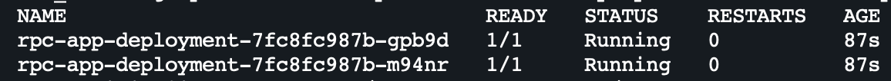
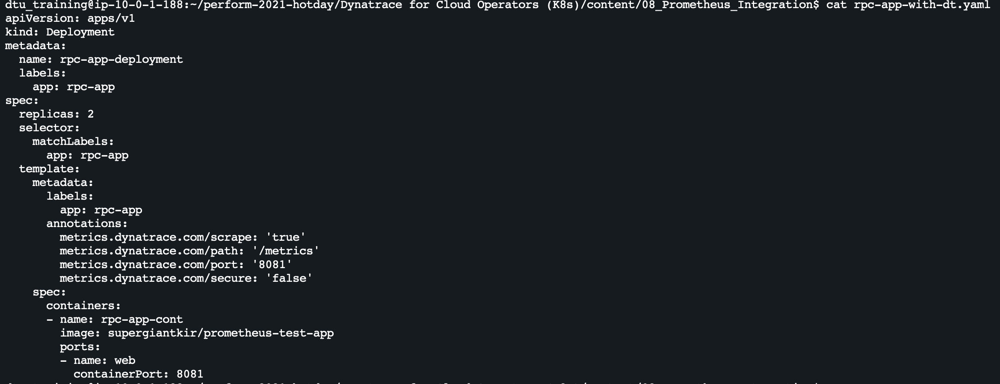

## Prometheus Integration

Navigate to session home directory

  ```
  cd /perform-2021-hotday/Dynatrace for Cloud Operators (K8s)/
  ```

### 1. Deploy a Sample Deployment

1. On the Bastion host create the sample app
   ```
   kubectl create -f content/08_Prometheus_Integration/rpc-app.yaml
   ```

2. Validate the pods are deployed
   ```
   kubectl get pods
   ```
   

3. Inspect the POD details
   Run the following command (use one of the pod names listed above)

   ```
   kubectl describe pod rpc-app-deployment-7fc8fc987b-m94nr
   ```   
   

### 2. Adding the Dynatrace annotations for Prometheus metrics

1. Inspect the modified manifest
   ```
   cat content/08_Prometheus_Integration/rpc-app-with-dt.yaml
   ```
   


2. Apply the modified manifest
   ```
   kubectl apply -f content/08_Prometheus_Integration/rpc-app-with-dt.yaml
   ```

### 3. Viewing Prometheus Data in Dynatrace   

1. In Dynatrace click on "Create Custom Chart"

2. Click on "Try it out"

3. Enter "go_threads" in the "filter metrics by" box

4. Split by "k8s.pod.name"

5. Click Run query
